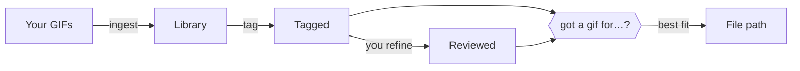

<h1 align="center">reaction-library</h1>

<p align="center">
  <a href="https://giphy.com/gifs/keanu-reeves-matrix-the-3o7btNhMBytxAM6YBa">
    
  </a>
</p>

<p align="center">
  <b>Your reaction GIFs, tagged once, found forever.</b><br>
  An <a href="https://docs.claude.com/en/docs/agents-and-tools/agent-skills">Agent Skill</a> that turns your personal pile of GIFs and memes into a library your AI assistant can actually use.
</p>

<p align="center">
  <a href="https://github.com/vdelaurenti/reaction-library/actions/workflows/ci.yml"></a>
  <a href="LICENSE"></a>
  
</p>

<p align="center">
  <a href="#quick-start">Quick start</a> ·
  <a href="#your-first-five-minutes">First five minutes</a> ·
  <a href="#how-it-works">How it works</a> ·
  <a href="#commands">Commands</a> ·
  <a href="#configuration">Configuration</a>
</p>

---

Each GIF gets a short comedic analysis: what happens, why it's funny, what sending it says, **when to use it, and when not to**. Then, mid-conversation, you ask *"got a gif for when the build finally passes?"* and get back the right file.

- **Local and private.** Your files and tags stay on your machine. The skill returns file paths; it never posts anything anywhere.
- **Picks by meaning.** "Something for a long week" finds the right GIF even if no tag says "long week".
- **Knows when not to.** Every tag records where a reaction would land badly, and it's checked before anything is suggested.

## Quick start

**1. Install [uv](https://docs.astral.sh/uv/).** It provides Python and the dependencies automatically.

| OS | Command |
|---|---|
| macOS | `brew install uv` |
| Linux | `curl -LsSf https://astral.sh/uv/install.sh \| sh` |
| Windows | `winget install --id=astral-sh.uv -e` |

**2. Install the skill.** In [Claude Code](https://claude.com/claude-code):

```
/plugin marketplace add vdelaurenti/reaction-library
/plugin install reaction-library@reaction-library
```

**Other agents** (Codex, Kiro, Cursor, Gemini CLI, and [70+ more](https://github.com/vercel-labs/skills)): install with the open [skills CLI](https://github.com/vercel-labs/skills), which puts the skill in the right folder for each agent you pick:

```
npx skills add vdelaurenti/reaction-library
```

Any agent works as long as it can run shell commands, since the skill runs its own CLI through `uv`.

<details>
<summary><b>Manual install</b></summary>

<br>

Clone the repo, then copy the skill folder into your agent's skills directory:

```
git clone https://github.com/vdelaurenti/reaction-library
cd reaction-library
```

| Agent | Skills directory |
|---|---|
| Claude Code | `~/.claude/skills/` |
| Codex | `~/.agents/skills/` |
| Kiro | `~/.kiro/skills/` |

- macOS / Linux: `cp -R skills/reaction-library ~/.claude/skills/`
- Windows (PowerShell): `Copy-Item -Recurse skills\reaction-library $HOME\.claude\skills\`

Swap in the directory for your agent.

</details>

## Your first five minutes

The library starts empty. Fill it with reactions you already like, then just talk to your assistant.

1. **Collect.** Save 10–20 GIFs or memes into one folder, such as `~/Downloads/reactions`. "Save as" from Slack, Giphy, or a browser all work.
2. **Add.**
   > Add the GIFs in ~/Downloads/reactions to my reaction library

   Duplicates and unsupported files are skipped and reported.
3. **Tag.**
   > Tag my new reactions

   The assistant studies each one, checks its own work, and tells you how many it tagged plus anything it wasn't sure about. Nothing is findable until it's tagged.
4. **Use.**
   > Got a gif for when the build finally passes?

   You get the file path and why it fits.
5. **Refine** *(optional)*.
   > Show me the tags · Let's play the quiz

   Approve or correct tags, or play the quiz: you see a GIF, say when you'd send it, and your wording is added to its tag.

Add more any time; only the new ones need tagging.

## How it works



**Tagging** is the only step where the model looks at images. Each GIF becomes a numbered contact sheet of up to four keyframes. The model writes the analysis, then reviews its own draft against a checklist built from real misses: other ways someone might send it, uses about the sender's own situation, chat-style phrasing, and captions that match the image. In agents that support subagents, batches of 10 are tagged in parallel, each in a fresh context, so even hundreds of GIFs add only about a hundred tokens each to your conversation.

**Finding** is plain text from then on. For libraries up to 300 tagged entries, the assistant reads a compact catalog (about 45 tokens per entry) once per conversation and picks by meaning, which handles moods and vague requests better than keyword search. Larger libraries use `search`, which matches word forms ("dancing" finds "dance"), synonyms, and phrases, and weights rare words higher.

**Refining** is yours. The model never marks its own tags as reviewed: `reviewed` means a person approved it, and reviewed entries rank first.

## Your library

It lives in `~/.reaction-library/` (`C:\Users\<you>\.reaction-library` on Windows):

```
index.json     the tags
media/         your files, renamed to their ids
.frames/       keyframes while tagging, deleted once a tag is saved (safe to delete)
index.lock     present only while a command is writing the index
```

The index stores relative paths, so one library in a synced folder works on every OS. See [Configuration](#configuration) to move it.

## Commands

Your assistant runs these for you. To run one yourself:

```
uv run skills/reaction-library/scripts/reaction_library.py <command>
```

On macOS and Linux the script is also directly executable.

| | Command | What it does |
|---|---|---|
| **Add** | `ingest <paths> [--move]` | Copy files or folders in, skipping duplicates |
| | `init` | Create an empty library (`ingest` does this for you) |
| **Tag** | `list [--status S]` | List entries: `untagged`, `tagged`, or `reviewed` |
| | `frames <ids> [--separate]` | Make a keyframe contact sheet (`--separate`: one file per frame) |
| | `tag <id> <file or ->` | Save one tag (JSON file, or `-` for stdin) |
| | `tag-batch <file or ->` | Save many tags from JSON Lines, one `{"id": ..., ...}` per line |
| | `review <ids>` | Mark tags as approved by you |
| | `retag <ids> \| --all \| --status S` | Clear tags so they get redone |
| **Find** | `catalog [--brief] [--max N] [--emotion T] [--humor T] [--kind K]` | One line per tagged entry |
| | `search "<moment>" [--emotion T] [--humor T] [--kind K] [--limit N] [--exclude IDS] [--format brief\|full]` | Ranked candidates for a moment |
| | `get <id>` | Everything stored for one entry |
| **Maintain** | `doctor` | Check your setup and the library |
| | `rebuild [--prune]` | Reconcile the index with `media/` |
| | `clean-frames [--all]` | Delete leftover keyframes |

## Configuration

| Setting | Default | What it does |
|---|---|---|
| `REACTION_LIBRARY` | `~/.reaction-library` | Where the library lives, for example a synced folder |
| `REACTION_CATALOG_MAX` | `300` | Largest library the compact catalog is used for; past it, `search` takes over |

To set one permanently:

- macOS / Linux: add `export REACTION_LIBRARY="$HOME/Dropbox/reaction-library"` to your shell profile
- Windows (PowerShell): `[Environment]::SetEnvironmentVariable("REACTION_LIBRARY", "$HOME\Dropbox\reaction-library", "User")`

The humor and emotion terms tags may use are in [`vocabulary.json`](skills/reaction-library/vocabulary.json). Search synonyms and phrases are in [`synonyms.json`](skills/reaction-library/synonyms.json); add your own freely.

## Development

```
uv run pytest
```

CI runs the tests on macOS, Linux, and Windows.

## License

[MIT](LICENSE)
